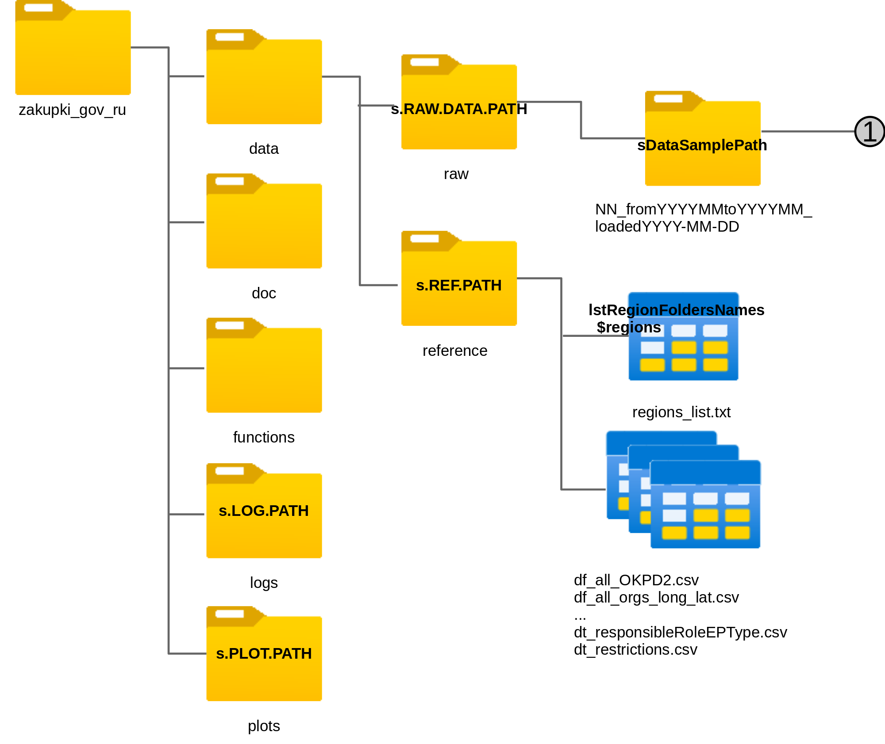
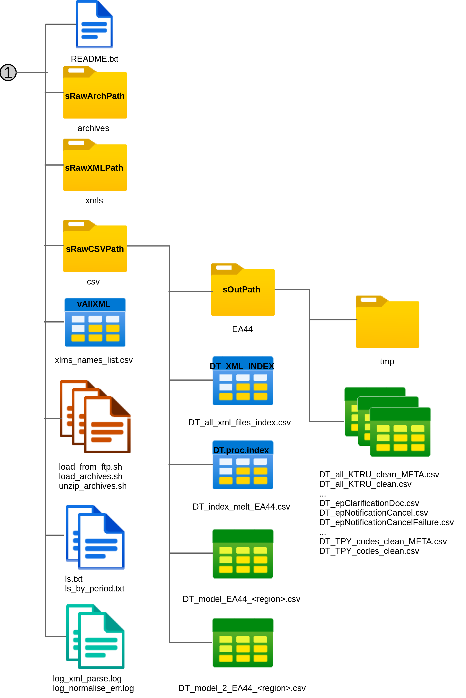

<!-- YAML-заголовок для вёрстки в word
---
title: "Руководство по загрузке данных"
author: "Светлана Суязова (Аксюк) s.a.aksuk@gmail.com"
date: "`r format(Sys.time(), '%d %B, %Y')`"
output: 
  word_document: 
    keep_md: yes 
    toc: true
    toc_depth: 4
--> 

```{r setup, include = FALSE}
knitr::opts_chunk$set(echo = T, eval = F)

```

Общие замечания:   

* Далее все пути к папкам указаны относительно директории репозитория, `zakupki_gov_ru`.   

* Большинство таблиц содержит данные в сложных форматах типа дат или ID, которые записаны цифрами, но могут начинаться с 0 и содержат фиксированное количество символов. Поэтому таблица обычно записывается и читается вместе с таблицей метаданных (имя заканчивается на "_META"). В таблице метаданных указаны классы столбцов, она собирается автоматически.   


## Как хранятся данные   

Данные загружаются по регионам. Исходники загружаются в `./data/raw` и не удаляются, но и не выгружаются на сервер github. Архивы сохраняются, чтобы при необходимости пересобрать данные.       
**Структура каталога данных**:   

* `./data/raw` -- содержит директории с выгрузками по регионам. Каждая директория называется по шаблону: `<порядковый номер>_from<период начала выгрузки в формате ГГГГММ>_to<период конца выгрузки в формате ГГГГММ>_loaded<дата загрузки архивов в формате ГГГГ-ММ-ДД>`;       

* `./data/raw/<папка выгрузки по региону>/archives` -- архивы по заданным региону и периоду, загруженные вручную с ftp госзакупок;      

* `./data/raw/<папка выгрузки по региону>/csv` -- таблицы с выбранной из архивов статистикой и с перменными для моделей. Непосредственно в этой папке лежат индексы xml-файлов (их имена содержат  "index") и таблицы с очищенными данными по региону для построения моделей (имена начинаются с "DT_model_");   

* `./data/raw/<папка выгрузки по региону>/csv/EA44` -- таблицы с выбранной из архивов статистикой;

* `./data/raw/<папка выгрузки по региону>/xmls` -- распакованные xml-файлы из папки с архивами.   

На рисунках ниже структура папок представлена подробнее, с указанием имён соответствующих переменных.  


*Рисунок 1. Структура папок репозитория, часть 1. Под значком папки/файла его имя в операционной системе, на значке -- значение переменной из скрипта, в которой имя хранится путь к папке или содержимое таблицы.*



*Рисунок 2. Структура папок репозитория, часть 2.*

**Важные файлы с описанием загруженных xml**:    

* `./data/raw/<папка выгрузки по региону>/README.txt` -- файл с описанием выгрузки: какой регион, за какой период, по каким процедурам (пока только электронные аукционы);   

* `./data/raw/<папка выгрузки по региону>/xlms_names_list.csv` -- список всех имён xml-файлов из папки `./data/raw/<папка выгрузки по региону>/xmls`. Нужно для экономии времени при индексации и разборе содержимого файлов;   

* `./data/raw/<папка выгрузки по региону>/*.log` -- логи с ошибками и предупреждениями, возникающими при разборе данных;    

* `./data/raw/<папка выгрузки по региону>/csv/DT_all_xml_files_index.csv` -- таблица-индекс xml-файлов. В строках стоят ID измещений (noticeID), в столбцах префиксы xml-файлов. Значения в таблице -- 0 или 1 -- указывают соответственно на отсутствие или наличие файла с префиксом для извещения;   

* `./data/raw/<папка выгрузки по региону>/csv/DT_index_melt_EA44.csv` -- краткая таблица-индекс xml-файлов, которая содержит только префикс файла, ID извещения и ID файла. Из этого индекса можно собрать имя xml с нужной процедурой по извещению.  

**Файлы с очищенными данными**:   

* `./data/raw/<папка выгрузки по региону>/csv/EA44/DT_all_KTRU_clean.csv` -- список всех закупок с [кодами КТРУ](https://zakupki.gov.ru/epz/ktru/start/startPage.html) товаров из закупок;   

* `./data/raw/<папка выгрузки по региону>/csv/EA44/DT_all_MNNName_clean.csv` -- список всех закупок с кодами медицинской и лекарственной продукции из закупок;   

* `./data/raw/<папка выгрузки по региону>/csv/EA44/DT_all_OKPD2_clean.csv` -- список всех закупок с [кодами ОКПД2](https://classifikators.ru/okpd) товаров из закупок;   

* `./data/raw/<папка выгрузки по региону>/csv/EA44/DT_TPY_codes_clean.csv` -- список всех закупок с кодами и названиями групп товаров, совмещёнными из трёх классификаторов: КТРУ, ОКПД2 и лекарственных средств;    

* `./data/raw/<папка выгрузки по региону>/csv/EA44/DT_restrictions_clean.csv` -- список всех закупок с кодами и именами ограничений на закупку;   

* `./data/raw/<папка выгрузки по региону>/csv/EA44/DT_responsibleOrgs_clean.csv` -- список организаций, ответственных за проведение аукционов;   

* `./data/raw/<папка выгрузки по региону>/csv/EA44/DT_<префикс>_clean.csv` -- таблицы с разобранными xml по заданному префиксу файла.    

**Справочники к данным** лежат в папке `./data/reference`:   

* `df_all_OKPD2.csv` -- все коды товаров с названиями по ОКПД2;   

* `df_OKPD2_2dig.csv` -- все двузначные коды товаров с названиями по ОКПД2;   

* `df_all_orgs.csv` -- все ответственные организации;   

* `df_all_orgs_long_lat.csv` -- попытка привязать все ответственные организации к карте, сейчас не используется;   

* `df_regions_codes.csv` -- все коды регионов;   

* `df_xml_patterns.csv` -- шаблоны для разбора загруженных xml-файлов;    

* `dt_all_post_addr_participants.csv` -- все почтовые адреса участников аукционов, для привязке к карте, сейчас не используется;   

* `dt_procedure_types.csv` -- типы процедур -- пока только электронные аукционы;    

* `dt_responsibleRoleEPType.csv` --  роли, которые исполняют ответственные организации;    

* `dt_restrictions.csv` -- ограничения на закупки;   

* `regions_list.txt` -- список регионов, загруженный с ftp госзакупок.    


## Как загружать и разбирать данные    


### 1 Создание переменных рабочего пространства и структуры папок с данными   

Скрипт **`parser-ftp-01_Setup-fz44.R`** делает две вещи:   

1. Создаёт глобальные переменные: период времени, регион, все пути к папкам с данными, url для загрузки данных.   

2. Загружает список регионов с сервера госзакупок. Это можно сделать 1 раз и дальше читать из `./data/reference/regions_list.txt`.   

3. Создаёт папки для загрузки данных, если не существуют.   


#### Последовательность действий  

1. Открыть скрипт `parser-ftp-01_Setup-fz44.R`.  
2. Сделать папку репозитория `zakupki_gov_ru` активной (можно как папку со скриптом): Session >> Set Working Directory >> To Source File Location    
3. Задать год и месяц выгрузки данных (например, январь 2020):  

```{r}
# январь 2020
sYEAR <- paste0(rep(2020, 1), # это год, повторяем столько раз,
                              # сколько будет месяцев
                formatC(1, # это номер месяца (январь)
                        width = 2, flag = '0'))

```

4. Раскомментировать часть названия одного региона (например, Башкирия) для поиска в общем списке регионов:

```{r}
# часть названия региона для поиска
# 01
srch.reg <- 'Bashk'

```

5. Если список регионов ещё не создан (т.е. при первом прогоне скрипта), загрузить его с сервера. Раскомментировать и запустить строки:  

```{r}
# /////////////////////////ВВОД ДАННЫХ В КОНСОЛЬ////////////////////////////////
# создаём список вариантов для выбора
vars <- data.frame(n = 1:2, txt = c('Перезагрузить с ftp', 
                                    'Прочитать сохранённый'))
# показываем варианты пользователю
message(paste0('Загрузка списка регионов:\n',
               paste0(apply(vars, 1, function(x){paste0(x, collapse = '. ')}),
                      collapse = '\n')))

# в этой строке читаем выбор пользователя
prompt.load.reg.list <- readline('Введите номер опции:')

```

Запустить кусок кода "Список директорий с регионами" (до следующего заголовка "Структура директорий папки с данными"). Убедиться, что в папке `./data/reference/` обновился файл `regions_list.txt`.   

При повторных прогонах раскомментировать строку с быстрой опцией:   

```{r}
# /////////////////////////ВВОД ДАННЫХ В КОНСОЛЬ////////////////////////////////
# создаём список вариантов для выбора
# vars <- data.frame(n = 1:2, txt = c('Перезагрузить с ftp', 
#                                     'Прочитать сохранённый'))
# показываем варианты пользователю
# message(paste0('Загрузка списка регионов:\n',
#                paste0(apply(vars, 1, function(x){paste0(x, collapse = '. ')}),
#                       collapse = '\n')))

# в этой строке читаем выбор пользователя
# prompt.load.reg.list <- readline('Введите номер опции:')

# быстрая опция 
prompt.load.reg.list <- 2

```

6. Запустить кусок кода с заголовка "Структура директорий папки с данными" по заголовок "Выбрать директорию вручную или создать новую".   

7. Раскомментировать строки:   

```{r}
# /////////////////////////ВВОД ДАННЫХ В КОНСОЛЬ////////////////////////////////
message('Выберите выгрузку:\n', msg)
prompt.load.sample <- readline('Введите номер опции:')
# быстрая опция: новая выгрузка
# prompt.load.sample <- n.dirs + 1
# быстрая опция: выбрать по названию региона
# prompt.load.sample <- n.dirs + 2
# /////////////////////КОНЕЦ ВВОДА ДАННЫХ В КОНСОЛЬ/////////////////////////////

```

При первом прогоне в консоли выбрать вариант 1.   

8. Запустить код до "все типы процедур". Раскомментировать строки:   

```{r}
# все типы процедур
#  на самом деле там пока только электронные аукционы
all.proc.types <- read.csv2(paste0(sRefPath, 'dt_procedure_types.csv'),
                            stringsAsFactors = F, fileEncoding = 'cp1251')

msg <- paste0(1:nrow(all.proc.types), '. ', all.proc.types$procedureType)

# /////////////////////////ВВОД ДАННЫХ В КОНСОЛЬ////////////////////////////////
message('Выберите процедуры:\n', msg)
# prompt.proc.type <- readline('Введите номер опции:')
# быстрая опция
prompt.proc.type <- 1
# /////////////////////КОНЕЦ ВВОДА ДАННЫХ В КОНСОЛЬ/////////////////////////////

```

Запустить код до конца файла. В папке с загрузкой появится файл `README.txt`.   


### 2 Загрузка файлов с сервера     

Скрипт **`parser-ftp-02_Load-Unzip-and-Index-fz44.R`**:   

1. Генерирует bash-скрипт для подключения к ftp, загрузки файлов согласно выбранным региону и периоду. Вспомогательные файлы `ls.txt` и `ls_by_period.txt` содержат соответственно списки файлов из директории региона на сервере и тот же список файлов, отфильтрованный по периоду времени. Чтобы загрузить архивы в папку "archives", нужно запустить последовательно файлы `load_from_ftp.sh` и `load_archives.sh`. Это можно сделать прямо из RStudio, окно "Terminal". ВНИМАНИЕ: скрипты генерируются пока только для Linux, протестировано на Ubuntu.   

3. Следующая часть скрипта создаёт файл `unzip_archives.sh` для распаковки архивов, его тоже надо запустить в терминале. Кроме распаковки скрипт удаляет все файлы с расширением ".sig", это экономит много места.      

4. После распаковки архивов в `xmls` делается их индексация. Цель - получить список уникальных номеров закупок (сохраняется в объект `vAllXML` и записывается в `./data/<текущая загрузка>/xlms_names_list.csv`)   


### 3 Индексация xml-файлов     

Это всё ещё скрипт **`parser-ftp-02_Load-Unzip-and-Index-fz44.R`**, часть после заголовка "ИНДЕКСАЦИЯ" до конца. Запускаем скрипт, в консоли появятся сообщения о том, сколько уникальных номеров извещений обнаружено.    

В конце скрипта создаётся важный вектор `vAllXML` -- это имена всех файлов xml в распакованных архивах (папка `./data/raw/<папка загрузки>/xmls`). Поскольку имён может быть очень много, а перебирать директорию каждый раз, оцень долго, этот вектор с именами записывается в файл `./data/raw/<папка загрузки>/xlms_names_list.csv`.    


### 4 Разбор xml-файлов   

Скрипт `parser-ftp-03_Parse-Loaded_XML-fz44.R`. Что он делает:   

1. На основе вектора с именами всех xml-файлов (объект `vAllXML`) и типа процедуры (объект `lProcedureToScrap$procedureCode`) создаёт таблицу с префиксами, ID извещения и уникальным id всех файлов для разбора (таблица `DT.proc.index`, которая записывается в файл `./data/raw/<папка загрузки>/csv/DT_all_xml_files_index.csv`). Это делается функцией `uf.make.file.index.for.proc()` по следующей логике:     

* берём имена `vAllXML`, которые имеют вид: "<префикс файла>_<ID закупки, 19 цифр>_<id файла, 8-9 цифр>.xml";   

* фильтруем по типу процедуры: электронный аукцион (значение из `lProcedureToScrap$procedureCode`);    

* вырезаем из оставшегося ID закупки (notification ID);     

* фильтруем имена xml-файлов по полученным ID закупки. Эти ID уникальны, и повторяются в названиях файлов для разных этапов жизни закупки. Таким образом у нас получатся файлы с разными префиксами, но ID будут относиться к тем закупкам, которые шли в формате электронных аукционов.     

2. Основываясь на xpath запросах из файла `./data/reference/df_xml_patterns`, разбираем xml-файлы. В процессе может оказаться, что один тег в xml-файле встречается несколько раз. Тогда все значения тега склеиваются в одну строку, через символ решётки. На данном этапе для каждого префикса xml-файла получается своя таблица, в которой одна строка это сведения, извлечённые из одного файла xml. Файлы .csv с результатами разбора записывается в папку `./data/raw/<папка загрузки>/csv/<код процедуры>`.    

3. Затем, из-за того что мы склеивали значения повторяющихся тегов в одно, надо нормализовать таблицы с выборками из xml. Поскольку таблицы выходят большие, они режутся на части и нормализуются по частям. Промежуточные результаты пишутся в папку `tmp`, затем склеиваются вместе. Положение осложняется тем, что в некоторых таблицах с результатами разбора xml-файлов представлены сведения о разных аспектах закупки. Если говорить в терминах базы данных, там соединены таблицы с разными ключами, поэтому расклеивать, например, `DT_fcsNotificationEA44` (или `DT_fksNotificationEA44`) приходится в несколько этапов. Это делается в разделе скрипта под заголовком "4. ЧИСТИМ RAW-ТАБЛИЦЫ". Надо прогнать эту часть скрипта и посмотреть, какие появятся ошибки. Они могут быть связаны с тем, что схема xml изменилась, либо появились какие-то новые исключения, и тогда придётся корректировать xpath запросы.   

ВНИМАНИЕ: парсинг файлов по Башкортостану за 2021 год показал, что кроме переименования `DT_fcsNotificationEA44` в `DT_fksNotificationEA44` изменились также некоторые имена тегов. Теперь придётся прочесать файл с шаблонами для разбора и добавить новые правила, обеспечив при этом обратную совместимость (это потребует изменения функции `uf_parse_xmls_with_prefix.R`).    


### 5 Подготовка данных для моделей   

Скрипты `parser-ftp-04_Prepare-Data-for-Models.R` и `parser-ftp-04_Prepare-Data-for-Models_2.R` делают на основе очищенных таблиц таблицу переменными для модели. На данных момент есть две спецификации модели, поэтому скрипта 2.   

Здесь есть по крайней мере одна сложность, которая пока не решена: расчёт длительности этапов электронного аукциона, если он проходил несколько раз (допустим, один раз не состоялся, и проводился заново). Почему-то по некоторым извещениям обнаруживается несколько дат на один этап аукциона, а некий внешний ключ для связи аукционов в цепочки, кроме собственно ID извещения, я пока не обнаружила.   


#### Модель 1   

Данные для модели собираются из статистики электронных аукционов по 44-ФЗ. Столбцы итоговой таблицы данных для модели №1 (файл `DT_model_EA44_<регион>.csv`):   

* purchaseNumber (тип character) – ID закупки;   

* docPublishDate_notice (тип POSIXct) – дата публикации объявления о закупке;   

* responsibleRole (тип character) – код роли ответственной организации;   

* lot.maxPrice (тип numeric) – начальная минимальная цена закупки;   

* restriction.shortName (тип character) – код ограничений на процедуру закупки;   

* purchaseObject.OKPD2.code.2dig (тип character) – двузначный код ОКПД2 товара закупки;   

* application.count.p01 (тип integer) – количество поданных на первом этапе заявок;   
* protocol01Date (тип POSIXct) – дата протокола первого этапа процедуры;    

* max.price.offers.quantity (тип numeric) – количество предложений цены от участников аукциона;    

* application.count.p02 (тип integer) – количество заявок на втором этапе аукциона;   

* time.stage.02.hours (тип numeric) – длительность второго этапа (предложения цен), в часах, рассчитанная как разница между временем самой последней и самой первой заявки всех участников аукциона;    

* protocol02Date (тип POSIXct) – дата протокола второго этапа аукциона;   

* winner.price (тип numeric) – цена победителя аукциона, рубли;    

* protocol03Date (тип POSIXct) – дата третьего этапа аукциона;   

* total.time.days (тип numeric) – суммарная длительность процедуры, дней;   

* time.stage.01.days (тип numeric) – длительность первого этапа процедуры, дней, рассчитанная как разница между датой публикации заявки (последней, если заходов было несколько) и датой прокотола первого этапа;   

* time.stage.03.days (тип numeric) – длительность третьего этапа процедуры, дней, как разница между датами протоколов третьего и второго этапов.   


#### Модель 2   

Данные для модели собираются из статистики электронных аукционов по 44-ФЗ. Столбцы итоговой таблицы данных для модели №1 (файл `DT_model_2_EA44_<регион>.csv`):   

* purchaseNumber (тип character) – ID закупки;   

* lot.maxPrice (тип numeric) – начальная минимальная цена закупки;   

* last.notice.date (тип POSIXct) – дата публикации заявки (если было несколько заходов, то берём последнюю дату);   

* SMP.only (тип numeric) – флаг: 1 закупка у субъектов среднего и малого предпринимательства, 0 в противном случае;   

* Nat.Regime (тип numeric) – флаг: 1 если есть ограничение на нацрежим, 0 если нет;   

* purchaseObject.OKPD2.code.2dig (тип character) – двузначный код ОКПД2 товара закупки;   

* application.count.p01 (тип integer) – количество поданных на первом этапе заявок;   

* application.reject.count.p01 (тип integer) – количество отклонённых на первом этапе заявок;    

* max.price.offers.quantity (тип numeric) – количество предложений цены от участников аукциона;    

* time.stage.01.days (тип numeric) – длительность первого этапа процедуры, дней, рассчитанная как разница между last.notice.date и датой прокотола первого этапа;   

* application.count.p02 (тип integer) – количество заявок на втором этапе аукциона;   

* time.stage02.hours (тип numeric) – длительность второго этапа (предложения цен), в часах, рассчитанная как разница между временем самой последней и самой первой заявки всех участников аукциона;    

* winner.price (тип numeric) – цена победителя аукциона, рубли;    

* auc.type (тип character) – флажок на отслеживание прогресса процедуры, вычисляется по ряду условий: '3 stages fail' сорвался на третьем этапе, '2 stages fail' сорвался на втором этапе, '1 stage fail' сорвался на первом этапе, 'single app' подана единственная заявка, 'single part' - остался единственный участник, 'success' аукцион прошёл успешно и конкурентно, 'cancel' аукцион отменён.   

* application.countryFullName (тип character) – страна организации, подавшей заявку, согласно протоколу;    

* single.app.proc.success (тип logical) – флаг на аукционы с единственной заявкой, завершившиеся успешно;   

* single.part.proc.success (тип logical) – флаг на аукционы с единственным участником, завершившиеся успешно;   

* winner.evades	(тип character) – 'yes' если победитель аукциона уклонился от заключения контракта, 'no' если нет;    

* single.app.rejected.ANR (тип numeric) – единственная заявка отклонена по причине несоответствия требованиям извещения или документации;    

* single.app.rejected.DNFV (тип numeric) – единственная заявка отклонена по причине неполного объема документов или недостоверной информации в заявке;    

* single.app.rejected.PNRD (тип numeric) – единственная заявка отклонена по причине несоответствия участника требованиям извещения или документации;   

* rejected.ANR (тип numeric) – заявки отклонены по причине несоответствия требованиям извещения или документации;  

* procedurelFailed (тип logical) – флажок на процедуры, не завершившиеся заключением контракта (F).   

