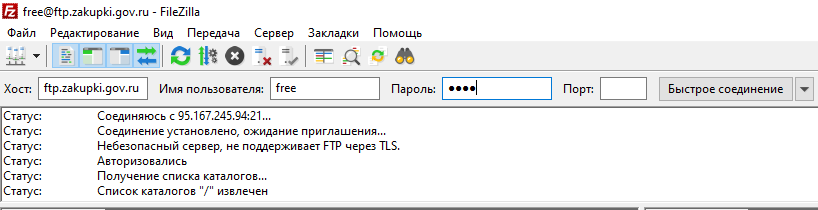
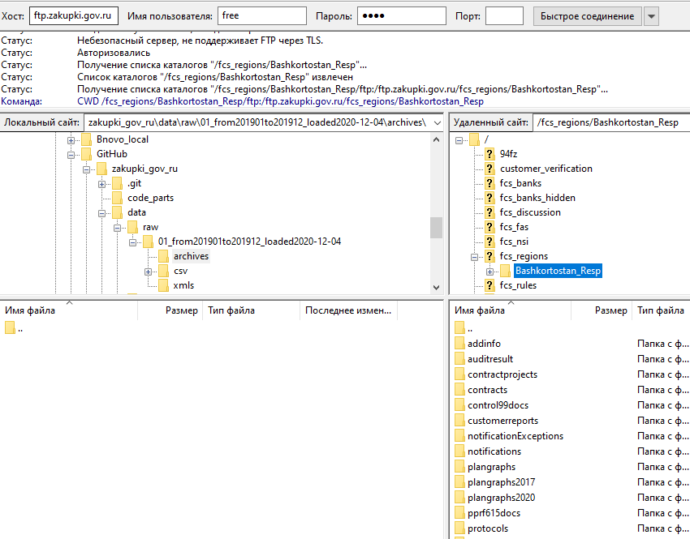
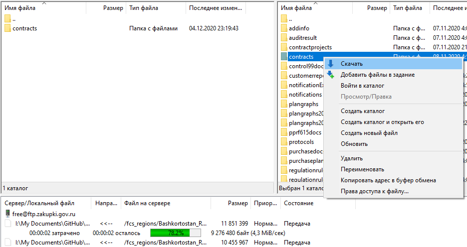

```{r setup, include = FALSE}
knitr::opts_chunk$set(echo = T, eval = F)

```


## 1 Создание переменных рабочего пространства и структуры папок с данными   

Скрипт **`parser-ftp-01_Setup-fz44.R`** делает две вещи:   

1. Создаёт глобальные переменные: период времени, регион, все пути к папкам с данными, url для загрузки данных.   

2. Загружает список регионов с сервера госзакупок. Это можно сделать 1 раз и дальше читать из `./data/reference/regions_list.txt`.   

3. Создаёт папки для загрузки данных, если не существуют.   


### Последовательность действий  

1. Открыть скрипт `parser-ftp-01_Setup-fz44.R`.  
2. Сделать папку репозитория `zakupki_gov_ru` активной (можно как папку со скриптом): Session >> Set Working Directory >> To Source File Location    
3. Задать год и месяц выгрузки данных (например, январь 2020):  

```{r}
# январь 2020
sYEAR <- paste0(rep(2020, 1), # это год, повторяем столько раз,
                              # сколько будет месяцев
                formatC(1, # это номер месяца (январь)
                        width = 2, flag = '0'))

```

4. Раскомментировать часть названия одного региона (например, Башкирия) для поиска в общем списке регионов:

```{r}
# часть названия региона для поиска
# 01
srch.reg <- 'Bashk'

```

5. Если список регионов ещё не создан (т.е. при первом прогоне скрипта), загрузить его с сервера. Раскомментировать и запустить строки:  

```{r}
# /////////////////////////ВВОД ДАННЫХ В КОНСОЛЬ////////////////////////////////
# создаём список вариантов для выбора
vars <- data.frame(n = 1:2, txt = c('Перезагрузить с ftp', 
                                    'Прочитать сохранённый'))
# показываем варианты пользователю
message(paste0('Загрузка списка регионов:\n',
               paste0(apply(vars, 1, function(x){paste0(x, collapse = '. ')}),
                      collapse = '\n')))

# в этой строке читаем выбор пользователя
prompt.load.reg.list <- readline('Введите номер опции:')

```

Запустить кусок кода "Список директорий с регионами" (до следующего заголовка "Структура директорий папки с данными"). Убедиться, что в папке `./data/reference/` обновился файл `regions_list.txt`.   

При повторных прогонах раскомментировать строку с быстрой опцией:   

```{r}
# /////////////////////////ВВОД ДАННЫХ В КОНСОЛЬ////////////////////////////////
# создаём список вариантов для выбора
# vars <- data.frame(n = 1:2, txt = c('Перезагрузить с ftp', 
#                                     'Прочитать сохранённый'))
# показываем варианты пользователю
# message(paste0('Загрузка списка регионов:\n',
#                paste0(apply(vars, 1, function(x){paste0(x, collapse = '. ')}),
#                       collapse = '\n')))

# в этой строке читаем выбор пользователя
# prompt.load.reg.list <- readline('Введите номер опции:')

# быстрая опция 
prompt.load.reg.list <- 2

```

6. Запустить кусок кода с заголовка "Структура директорий папки с данными" по заголовок "Выбрать директорию вручную или создать новую".   

7. Раскомментировать строки:   

```{r}
# /////////////////////////ВВОД ДАННЫХ В КОНСОЛЬ////////////////////////////////
message('Выберите выгрузку:\n', msg)
prompt.load.sample <- readline('Введите номер опции:')
# быстрая опция: новая выгрузка
# prompt.load.sample <- n.dirs + 1
# быстрая опция: выбрать по названию региона
# prompt.load.sample <- n.dirs + 2
# /////////////////////КОНЕЦ ВВОДА ДАННЫХ В КОНСОЛЬ/////////////////////////////

```

При первом прогоне в консоли выбрать вариант 1.   

8. Запустить код до "все типы процедур". Раскомментировать строки:   

```{r}
# все типы процедур
#  на самом деле там пока только электронные аукционы
all.proc.types <- read.csv2(paste0(sRefPath, 'dt_procedure_types.csv'),
                            stringsAsFactors = F, fileEncoding = 'cp1251')

msg <- paste0(1:nrow(all.proc.types), '. ', all.proc.types$procedureType)

# /////////////////////////ВВОД ДАННЫХ В КОНСОЛЬ////////////////////////////////
message('Выберите процедуры:\n', msg)
# prompt.proc.type <- readline('Введите номер опции:')
# быстрая опция
prompt.proc.type <- 1
# /////////////////////КОНЕЦ ВВОДА ДАННЫХ В КОНСОЛЬ/////////////////////////////

```

Запустить код до конца файла. В папке с загрузкой появится файл `README.txt`.   


## 2 Загрузка файлов с сервера     

Скрипт **`parser-ftp-02_Load-Unzip-and-Index-fz44.R`**:   

1. Выдаёт в консоль `my.region$url`, с которого надо вручную загрузить архивы в папку текущей загрузки >> archives. Название текущей папки загрузки лежит в переменной `sDataSamplePath`.   

2. Дальше надо вручную скачать архивы с сервера.   

3. Следующая часть скрипта создаёт файл для распаковки архивов, но только под linux.   

4. После распаковки архивов в `xmls` делается индексация. Цель - получить список уникальных номеров закупок (сохраняется в объект `all.xmls` и записывается в `./data/<текущая загрузка>/xlms_names_list.csv`)


### Скачивание архивов с помощью FileZilla

1. Создать подключение к серверу `ftp.zakupki.gov.ru`, логин `free`, пароль `free`.    

```{r, out.width = '7in', eval = T, echo = F}


```

2. В поле "Локальный сайт" выбрать папку из переменной `sDataSamplePath`, и внутри неё `archives`. В поле "Удалённый сайт" ввести кусок url из переменной `my.region$url`, начиная с "/fcs_regions/" и дальше. Для Башкортостана будет "/fcs_regions/Bashkortostan_Resp/".    

```{r, out.width = '7in', eval = T, echo = F}


```

3. Скачать из папок: `contracts`, `protocols`, `notifications` -- архивы за нужный период времени. В именах архивов в этих папках закодирован год и месяц в формате "ГГГГММ", выбираем нужные.         

```{r, out.width = '7in', eval = T, echo = F}


```


